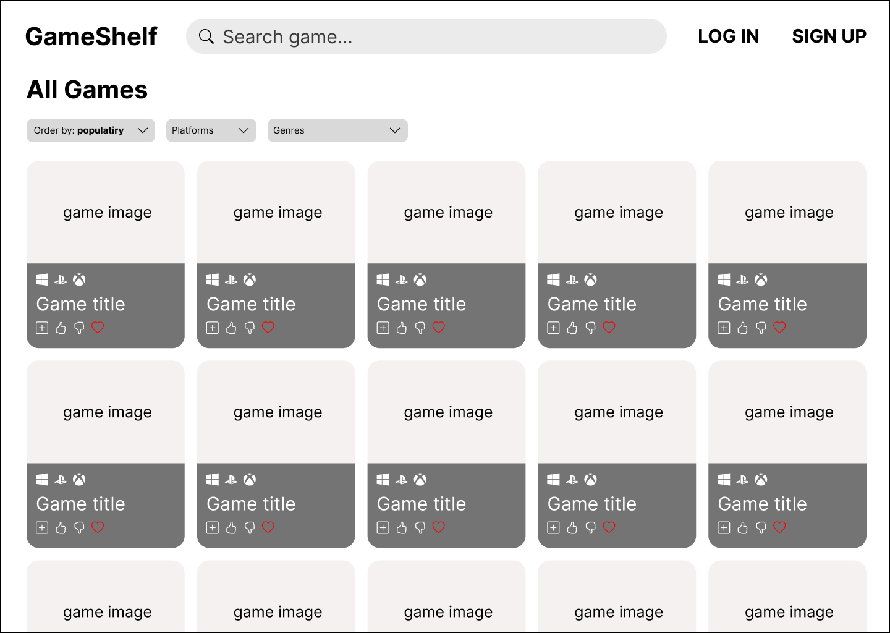
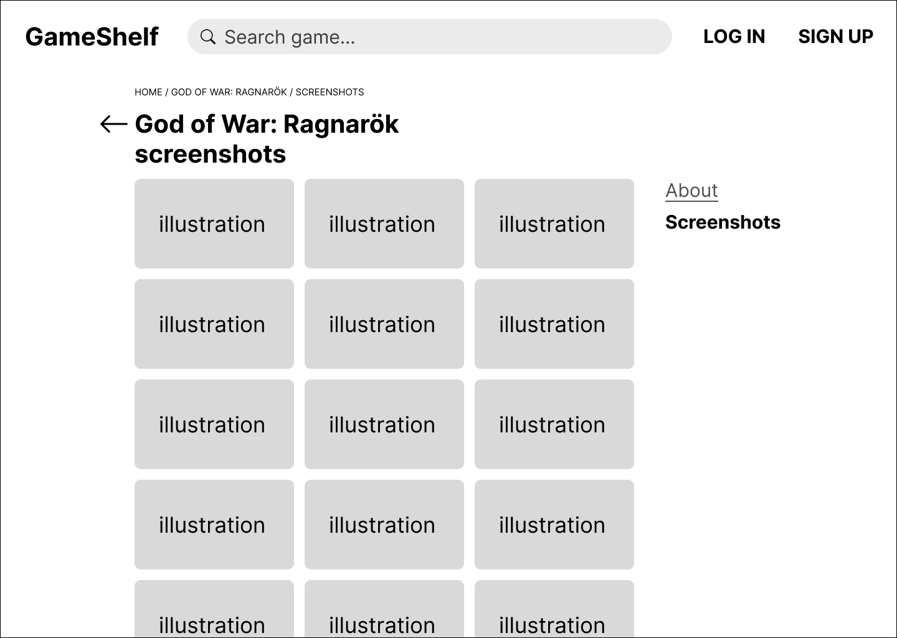
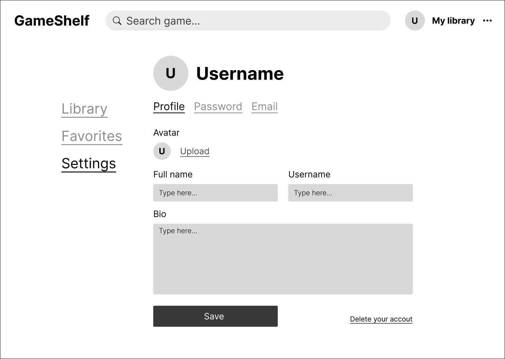

# Требование к проекту
---
# Содержание
1 [Введение](#1-введение)  
2 [Требования пользователя](#2-требования-пользователя)  
2.1 [Программные интерфейсы](#21-программные-интерфейсы)  
2.2 [Интерфейс пользователя](#22-интерфейс-пользователя)

# 1 Введение

**Название продукта:** GameShelf  

**Контекст проекта:**  
GameShelf — это упрощённый аналог сервисов наподобие [RAWG](https://rawg.io), предназначенный для просмотра информации об играх и управления собственной библиотекой.  
Цель проекта — предоставить пользователю удобный каталог видеоигр с базовыми функциями поиска, фильтрации и оценки, без избыточных возможностей крупных сервисов.  

## Функционал, который будет реализован
- Просмотр каталога игр (данные из RAWG API).  
- Просмотр детальной страницы каждой игры.  
- Добавление игр в личную библиотеку.  
- Возможность оценивать игры.  
- Поиск игр по названию.  
- Фильтрация игр по параметрам.  
- Регистрация и авторизация пользователей.  
- Удаление аккаунта.  

## Функционал, который **не будет реализован**
- Восстановление и подтверждение пароля.  
- Написание отзывов к играм.  
- Интеграция с внешними сервисами (Steam, PlayStation и т.д.).  
- Список желаемого (wishlist).  
- Деление игр в библиотеке на категории (например: «прошёл», «играю», «буду играть»).  
- Создание собственных коллекций игр.  
- Подписки на других пользователей.

# 2 Требования пользователя

# 2.1 Программные интерфейсы
Приложение использует ресурсы сервиса [RAWG](https://rawg.io).

# 2.2 Интерфейс пользователя
Главная страница сайта:  

Варианты в выпадающих списках для сортировки:  

Ввод чего-либо в поиске:  

Нажатие Enter или кнопки See all results:  

Состояние карточки с игрой после наведения на нее курсора мыши:  

Состояние карточки при добавлении ее в свою библиотеку и нажатия кнопки с сердечком:  

Переход на страницу игры:  

Переход на страницу со скриншотами выбранной игры:  

Страница авторизации:  

Страница регистрации:  

Изменение шапки сайта при авторизации/регистрации:  

Страница библиотеки игр пользователя:  

Страница любимых игр пользователя:  

Страница настроек профиля пользователя:  

Страница изменения пароля:  

Страница изменения электронной почты:  

Страница подтверждения об удалении аккаунта:  

