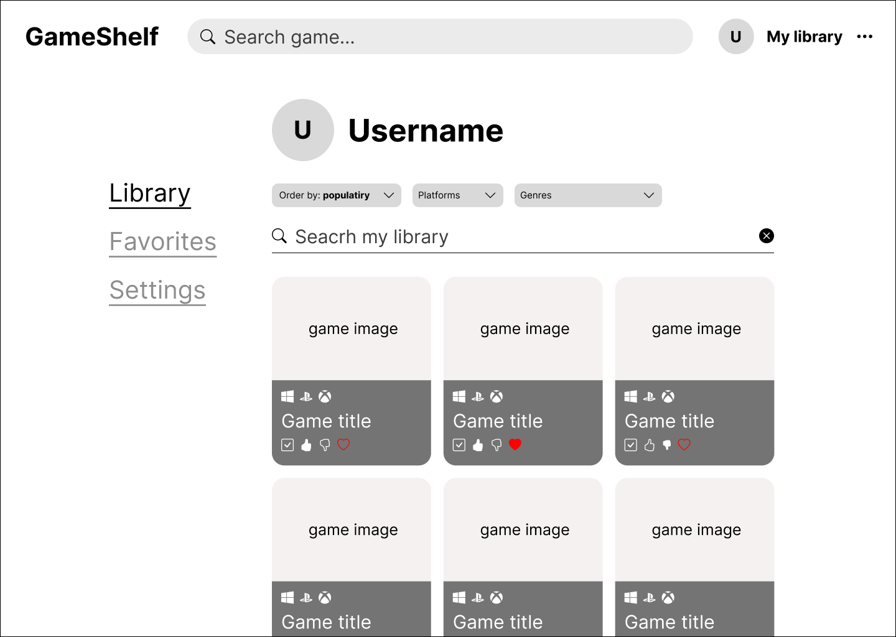
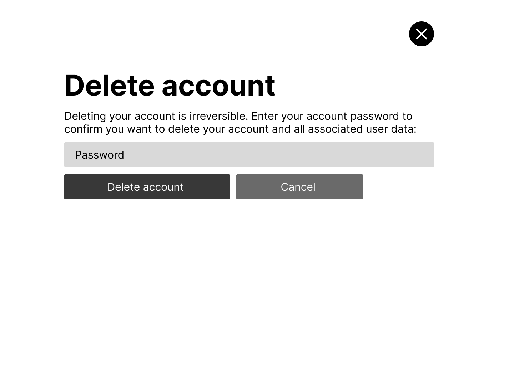

# Требование к проекту

# Содержание
1 [Введение](#1-введение)  
 1.1 [Назначение](#11-назначение)  
 1.2 [Область применения](#12-область-применения)  
2 [Общее описание](#2-общее-описание)  
 2.1 [Перспектива продукта](#21-перспектива-продукта)  
  2.1.1 [Программные интерфейсы](#211-программные-интерфейсы)  
  2.1.2 [Интерфейс пользователя](#212-интерфейс-пользователя)  
 2.2 [Функции продукта](#22-функции-продукта)  
 2.3 [Характеристики пользователей](#23-характеристики-пользователей)  
 2.4 [Ограничения](#24-ограничения)  
 2.5 [Предположения и зависимости](#25-предположения-и-зависимости)  
  2.5.1 [Предположения](#251-предположения )  
  2.5.2 [Зависимости](#252-зависимости)  
3 [Системные требования](#3-системные-требования)  
 3.1 [Функциональные требования](#31-функциональные-требования)  
 3.2 [Нефункциональные требования](#32-нефункциональные-требования)  
  3.2.1 [Атрибуты качества](#321-атрибуты-качества)  
  3.2.2 [Ограничения реализации](#322-ограничения-реализации)  

# 1 Введение  

## 1.1 Назначение  
Данный документ описывает требования к веб-приложению **GameShelf**.  
Документ предназначен для разработчиков, тестировщиков и проверяющих учебный проект.  

## 1.2 Область применения  
GameShelf — это веб-приложение для просмотра информации о видеоиграх и управления личной библиотекой.  
Продукт является упрощённым аналогом сервисов вроде [RAWG](https://rawg.io).  

Возможности:  
- Просмотр каталога игр из RAWG API.  
- Поиск и фильтрация игр.  
- Добавление игр в библиотеку и список «любимых».  
- Оценивание игр.  
- Регистрация, авторизация и управление аккаунтом.  

Ограничения:  
- Нет восстановления пароля и подтверждения email.  
- Нет интеграций с внешними сервисами (Steam, PlayStation и др.).  
- Нет отзывов и коллекций.  
- Нет расширенной категоризации игр в библиотеке.
- Нет мобильной версии.   

---

# 2 Общее описание  

## 2.1 Перспектива продукта  
Система является самостоятельным веб-приложением, использующим данные из RAWG API. Интерфейс реализуется как SPA с возможностью динамической подгрузки данных.  

### 2.1.1 Программные интерфейсы
Веб-приложение использует ресурсы сервиса [RAWG](https://rawg.io), а также внешние CSS и JS библиотеки.

### 2.1.2 Интерфейс пользователя
Главная страница сайта:  

Варианты в выпадающих списках для фильтрации:  

Ввод чего-либо в поиске:  

Нажатие Enter или кнопки See all results в поиске:  

Состояние карточки с игрой после наведения на нее курсора мыши:  

Состояние карточки при добавлении ее в свою библиотеку и нажатия кнопки с сердечком:  

Переход на страницу игры:  

Переход на страницу со скриншотами выбранной игры:  

Страница авторизации:  

Страница регистрации:  

Изменение шапки сайта при авторизации/регистрации:  

Наведение на три точки рядом с "My library":

Страница библиотеки игр пользователя:  

Страница любимых игр пользователя:  

Страница настроек профиля пользователя:  

Страница изменения пароля:  

Страница изменения электронной почты:  

Страница подтверждения об удалении аккаунта: 

## 2.2 Функции продукта  
- Просмотр каталога игр.  
- Просмотр детальной страницы игры.  
- Поиск и фильтрация игр.  
- Регистрация и авторизация пользователей.  
- Управление аккаунтом (изменение email и пароля, удаление).  
- Добавление игр в библиотеку.  
- Добавление игр в список «любимых».  
- Оценивание игр.  

## 2.3 Характеристики пользователей  
Пользователи GameShelf делятся на несколько групп:  

| Группа пользователей         | Возраст  | Опыт в играх              | Техническая грамотность | Цели |
|-------------------------------|----------|--------------------------|-------------------------|------|
| Новички                       | 13–25    | Ограниченный              | Средняя                 | Найти популярные игры, оценивать |
| Опытные игроки                | 18–35    | Значительный              | Высокая                 | Управлять библиотекой, фильтровать |
| Интересующиеся индустрией     | 15–40    | Играют редко              | Средняя                 | Просматривать новинки, читать описания |

## 2.4 Ограничения  
- Поддерживаются только современные браузеры.  
- Система требует стабильного интернет-соединения.  
- Поддержка мобильных устройств не входит текущую версию.  

## 2.5 Предположения и зависимости  

### 2.5.1 Предположения  
- Пользователи имеют доступ к современным веб-браузерам с поддержкой JavaScript и CSS.  
- У пользователей есть стабильное интернет-соединение для загрузки данных из RAWG API.  
- Пользователи обладают базовыми навыками работы с веб-приложениями.  
- Все изображения и медиа, используемые в интерфейсе, доступны и корректно загружаются с сервера.  
- Регистрация и авторизация будут происходить через стандартную форму с email и паролем.

### 2.5.2 Зависимости
- Система зависит от API RAWG для получения данных о играх. Любые изменения или недоступность API могут повлиять на функциональность каталога.  
- Внешние CSS и JS библиотеки, используемые для интерфейса, должны быть доступны и корректно подключены.  
- Работа функций фильтрации, поиска и сортировки зависит от корректной обработки данных на клиенте и сервере.  
- Серверное окружение должно быть настроено и иметь доступ к статическим ресурсам и базам данных для хранения информации о пользователях и их библиотеке.  

---

# 3 Системные требования  

## 3.1 Функциональные требования  

**FR-1. Каталог игр** — система должна предоставлять каталог игр из RAWG API.  
**FR-2. Детальная страница игры** — система должна отображать описание, жанры, дату выхода, скриншоты и т.п.  
**FR-3. Поиск игр** — система должна предоставлять поиск по названию.  
**FR-4. Фильтрация и сортировка** — система должна предоставлять фильтрацию и сортировку игр.  
**FR-5. Регистрация** — система должна позволять создавать новый аккаунт (email, пароль).  
**FR-6. Авторизация** — система должна предоставлять вход по email и паролю.  
**FR-7. Управление аккаунтом** — система должна позволять изменять email и пароль, а также удалять аккаунт.  
**FR-8. Личная библиотека** — система должна позволять добавлять игры в библиотеку и удалять их.  
**FR-9. Любимые игры** — система должна позволять добавлять игры в список «любимых».  
**FR-10. Оценка игр** — система должна позволять оценивать игры.  

## 3.2 Нефункциональные требования  

### 3.2.1 Атрибуты качества  
- **Надёжность:** доступность ≥ 95%.  
- **Безопасность:** хранение паролей в зашифрованном виде.  
- **Удобство использования:** основные функции доступны в неболее чем 3 кликов.  
- **Производительность:** загрузка страниц не более 3 секунд.  
- **Совместимость:** поддержка последних версий современных браузеров.   

### 3.2.2 Ограничения реализации  
- Зависимость от RAWG API.  
- Отсутствие восстановления пароля в текущей версии.  
- Отсутствие поддержки мобильных устройств в текущей версии.  

